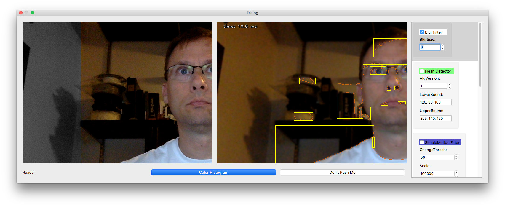
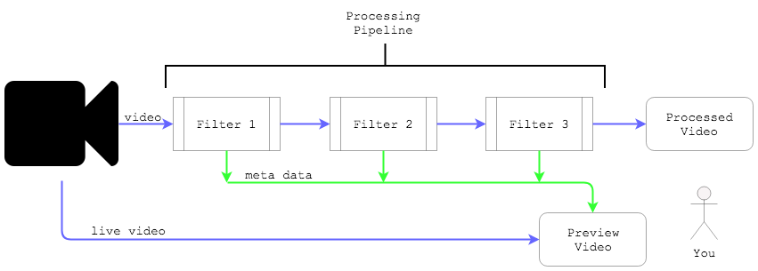
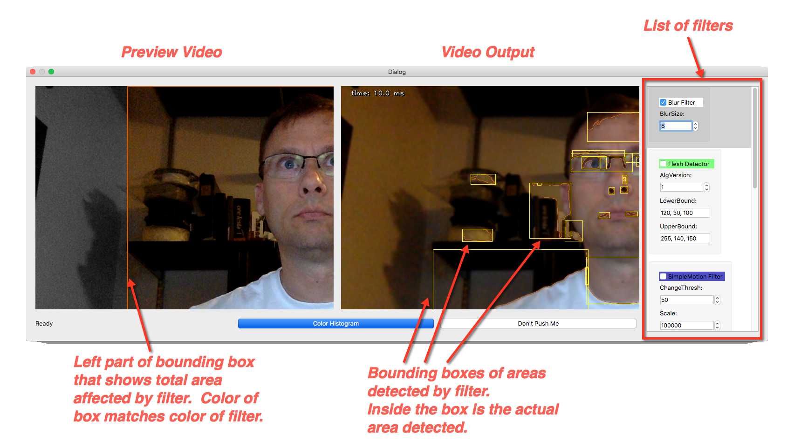

# vidpipe
Video data processing pipeline using OpenCV

A video processing toolset that allows the user to interactively modify the data in the video stream to
see the immediate effect.

The processing flow is a pipeline that uses filters to transform the data in discrete steps along the dataflow path.

A *filter* is an object made from a simple python file that that has processing functions called from the main app.  The main processing function is passed a single video frame data buffer.  That data can be examined and/or modified.  The new data can then be passed back to the main app.  (See [SampleFilter.py](https://github.com/jchrisweaver/vidpipe/blob/master/vidpipe/SampleFilter.py) for a simple example.)

Filters are arranged and called in a specific order to create a data flow.  The order of the filters matches the order in which they appear in the right-hand side of the dialog box in the scroll window.  Each filter can enabled, disabled or drag-drop rearranged to change the processing order.  Each filters effects can be immediately visible in the processed video feed and compared to the preview video feed.

Each filter takes a single action.  For example, the Blur Filter takes an incoming video frame, applies a blur action to the frame data and then passes the new frame data to the next filter in the path.

**The filters that are currently implemented are:**

* Blur filter - uses OpenCV [GaussianBlur](https://docs.opencv.org/2.4/modules/imgproc/doc/filtering.html?highlight=gaussianblur#gaussianblur) function
* Simple motion detector
* Edge detector - uses OpenCV [Canny](https://docs.opencv.org/2.4/modules/imgproc/doc/feature_detection.html?highlight=canny#canny) and [findCountours](https://docs.opencv.org/2.4/modules/imgproc/doc/structural_analysis_and_shape_descriptors.html?highlight=findcontoures#findcontours) functions
* Activity detector

**New filters can be added with the following steps:**
*TODO: Add steps here!*

The GUI is designed with QT for simplicity, which must be installed manually (https://www.qt.io/download)

**Why I Wrote This**

I took the [PyImageSearch Gurus](https://www.pyimagesearch.com/pyimagesearch-gurus/) course to learn more about computer vision.  Many of
the steps required to process an image have several discrete stages of manipulation or analyis of the image data to arrive at a result.

I wanted to better understand how each discrete step affected the image data and how rearranging the order of each step affected the data.  This tool made it extremelty easy to visualize each step.  I've continued to add additional fun filters as time and interest permit.

If you use and enjoy this tool, please let me know @jchrisweaver on twitter.

And by all means, please submit PRs if you'd like to add features, fix bugs, etc.
<!--stackedit_data:
eyJoaXN0b3J5IjpbLTIwNzk2Njg5NTYsODAwMTU1NDEsMTE0OT
I0NzIwLDE0NjkxMzk5NzJdfQ==
-->
